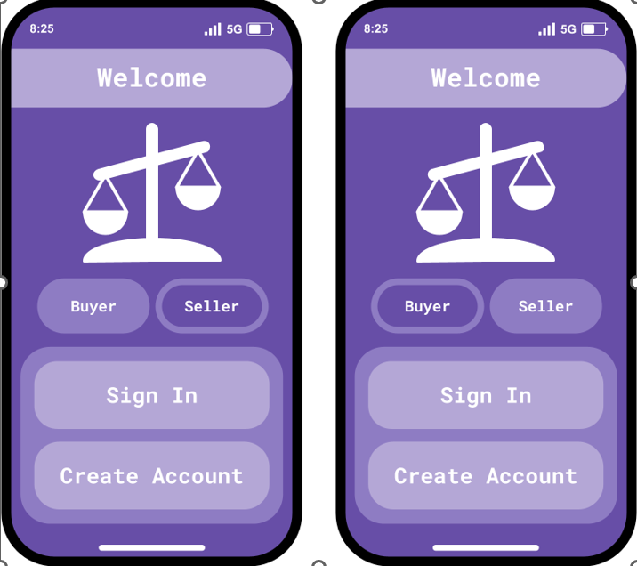
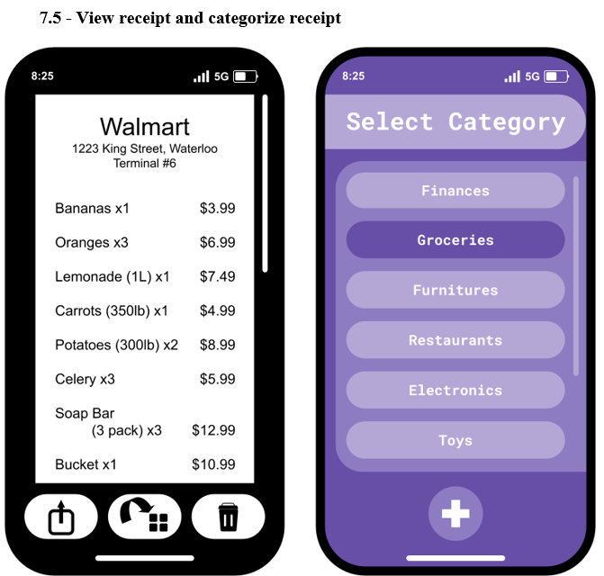

Balance: Digital Receipt Management System

"Balance" is an innovative digital solution aimed at transforming the traditional receipt handling process. It consists of a dual-component system: a specialized terminal integrated into Point-of-Sale (POS) machines, and a user-friendly mobile application. The terminal uses Near-Field Communication (NFC) technology to transmit detailed receipt data directly to the user's smartphone application. This system offers an eco-friendly, paperless solution for receipt management, helping both consumers and retailers to organize and track purchases efficiently and sustainably.

Installation Instructions for Balance
1. Ensure you have installed the latest version of mySQL to your device
    a. https://dev.mysql.com/downloads/
2. After installing mySQL, open your mysql terminal window, log in, and run the following command to create the database:
    a. CREATE DATABASE balance_db;
2. In your terminal, navigate to the folder to which you have extracted the code files
3. Run the following command to start the virtual environment and get access to the required packages
    a. For Windows: kivy_venv\Scripts\activate
    b. For MacOS:   source kivy_venv/bin/activate
    c. If these commands do not work, try first installing the virtualenv package with pip install virtualenv
    d. Alternatively, you can run the program without the virtual environment by installing the required packages globally
       with: 
          freeze > requirements.txt
          pip install -r requirements.txt
4. Run command 'python main.py' to begin the application
    Note: The application may have to be run twice to properly create the database system on your device

It is assumed that the person testing this application will not have access to an NFC point of sales terminal necessary
to add receipts to their account. To make up for this, we have included several receipt files that can be received
through the receive receipt use case. Instructions for this process follow:
1. Create an account or log into an existing account
    a. Ensure that your input is valid. The app won't crash but it won't do anything either.
    b. A valid email just needs to be standard email format Ex: a@b.ca
    c. A valid phone number is 10 digits with no other characters Ex: 5195553434
    d. A valid password needs at least 8 characters
2. When you are greeted with the main screen, click the "Receive Receipt" button
3. Navigate through your device's file system to find the receipt files and click on one to import it
4. Repeat this process for as many receipts you want to import to your account

